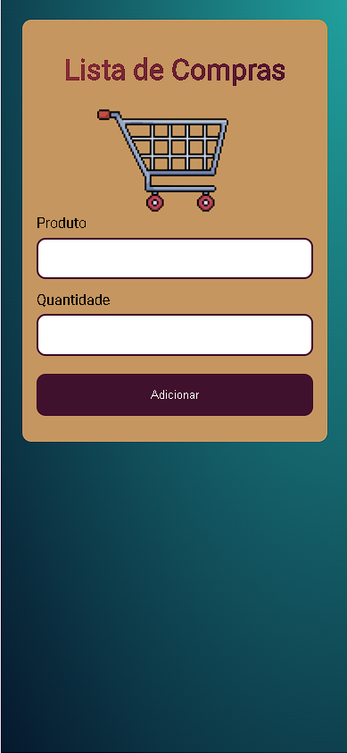

# Lista-de-compras
Monte uma lista de produtos para levar onde quiser! 
:cheese: :broccoli: :apple: :pizza:

:iphone:  :rotating_light: Projeto desenvolvido para mobile! Abra o link em um celular! :rotating_light: :iphone:

## DETALHES DO PROJETO:
O objetivo do projeto foi criar uma lista de itens simples, onde podemos adicionar itens, remover,
e atualizar a quantidade de itens iguais.
A lista de produtos fica armazenada no localstorage do navegador do usuário, desta forma
mesmo que a página é recarregada os itens da lista permanecem sem ser alterados!

## Disponível para mobile!
Por ser uma ferramenta simples, este projeto foi desenvolvido principalmente para mobile, 
para o usuário poder usar em qualquer lugar.

## Foto do Projeto para mobile

## TECNOLOGIAS USADAS NO PROJETO:
* HTML
* CSS
* JavaScript
